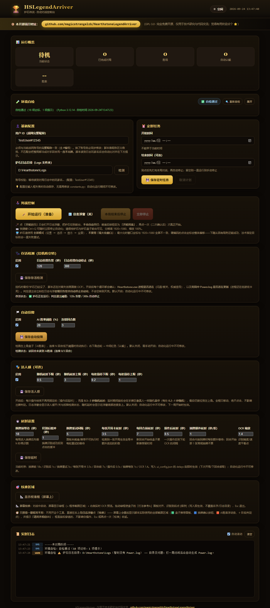
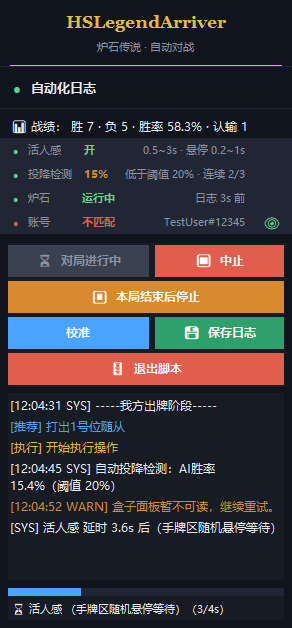
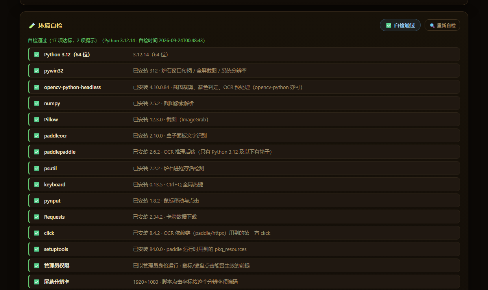
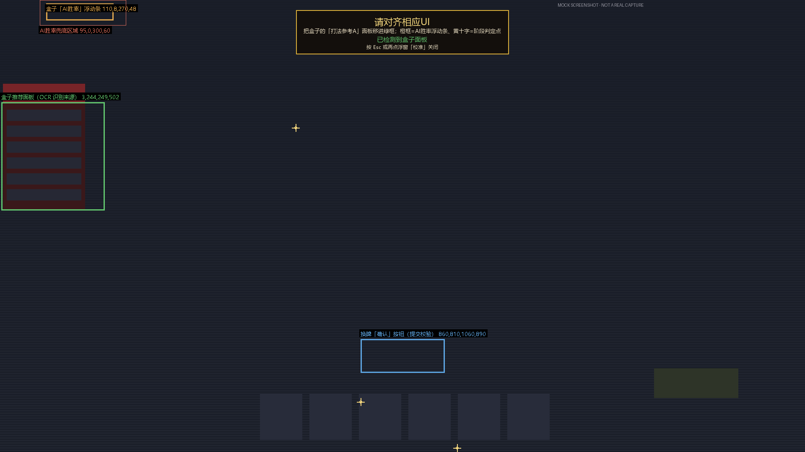

<div align="center">

# 🏆 HSLegendArriver（胜率63.8的炉石传说脚本）

### 帮你走完上传说的路

**读取炉石日志 + 获取炉石盒子打法建议 + 自动执行操作**

**33 分钟：钻石 2 → 传说**  
**一下午：冲到传说约 6000 名**  
**多盘实测胜率：机械骑 82.4%（17 局 14 胜）、号角骑 65%、弃牌术 63.8%**

<br>

> 🔥 已实测支持：**机械骑 / 号角骑 / 弃牌术 / 海盗瞎**  
> 🤖 自动识别对局、读取推荐打法并完成出牌操作  
> 🩺 无人值守安全：**炉石闪退/卡死会醒目告警并自动停止**，不会对着失效画面空转到天亮  
> 🧪 第一次启动就自检：**Python 是否 3.12**、依赖是否装全、分辨率/缩放对不对，逐项 ✅/❌  
> 🎯 浮窗一键「校准」：屏幕上叠加画出**所有截图区域框**，照着把盒子 UI 摆正

</div>

---

## ✨ 项目简介

**HSLegendArriver（传说到达者）** 是一个用于《炉石传说》的自动化打法执行器。

项目通过读取炉石对局日志，并结合 **炉石盒子「推荐打法」** 提供的推荐操作，自动识别当前对局状态并执行对应的鼠标点击与键盘操作。

简单来说：

> **炉石盒子负责告诉你"怎么打"，HSLegendArriver 负责帮你"打出去"。**

## 📊 实测卡组胜率

| 卡组 | 胜率 | 实测场次 |
|---|---|---|
| 机械骑 | 82.4% | 17 局 14 胜 |
| 号角骑 | 65% | 未统计 |
| 弃牌术 | 63.8% | 多盘实测 |
| 海盗瞎 | 已实测支持 | — |

## ⚠️ 先看两条最容易忽略的配置

> 这两条不看，脚本会「看起来在跑、实际什么都不做」或「一直重试到天亮」。

### 1. 炉石必须用**全屏模式**，不要用「最大化窗口」

程序的点击坐标是按 **1920×1080 全屏** 写死的。窗口化 / 最大化时，窗口客户区与全屏画面存在偏移，**所有点击会整体错位**：

- 下随从因为有吸附，看上去还能成功；
- **法术指定目标会持续失败重试**（一直打不出牌）。

请在炉石里设置：`设置 → 选项 → 显示 → 显示模式 = 全屏`，同时桌面分辨率 **1920×1080**、Windows 缩放 **100%**。

### 2. 换战网账号后，必须同步更新「用户 ID」为**完整昵称（含 #编号）**

脚本完全靠昵称区分敌我（日志里 `TAG_CHANGE Entity=你的昵称 ...`）。昵称与当前账号不一致时，**整局都会被判成「对手回合」而一张牌都不出**，日志里也看不出报错。

现在脚本会自己校验并提示：读到对局日志中的玩家名后自动比对，不一致时

- 网页顶部弹出橙色横幅、基础配置卡片下方标红；
- 日志与右上角浮窗打出 `⚠️ 用户 ID 与日志玩家名不匹配` 并显示日志里的真实昵称（可直接照抄）。

## 🖼️ 界面预览

**Web 控制台**（`python web_ui.py` 后浏览器自动打开）



**右上角实时日志浮窗**（品牌行 + 状态面板 + 按标签着色的日志 + 延时进度条；告警行红色高亮）



**炉石退出 / 昵称不匹配时的醒目告警**（判定后自动停止自动化，不再对失效画面空转）


**自动投降**：避免控制卡组的折磨，可自主设定投降阈值与连续回合数


## 🐍 详细安装（含 pip 与清华镜像）

> 需要 **Python 3.12**（自带 pip）。

### 1. 安装 Python 3.12
- 到 <https://www.python.org/downloads/> 下载 **Python 3.12** 安装包（非常重要，当前出现多个安装成3.14导致无法识别的朋友，如果你后续的分辨率都是设置正确，脚本可以正确点击开始游戏但是进入游戏后卡在换牌且AI识别都无法正常工作，必须检查当前python的版本是否为3.12！）；
- 安装时**务必勾选 "Add python.exe to PATH"**；
- 装完在 PowerShell 运行 `python --version` 验证。

### 2. 用清华 TUNA 镜像安装依赖
**请把项目源代码下载到一个没有中文字符的路径下**
**请把项目源代码下载到一个没有中文字符的路径下**
**请把项目源代码下载到一个没有中文字符的路径下**
在项目根目录右键打开 PowerShell，运行：
```text
pip install -r requirements.txt -i https://pypi.tuna.tsinghua.edu.cn/simple
```
依赖较大（含 PaddleOCR / PaddlePaddle），耐心等待。

### 3. 启动
- **以管理员身份**运行：
  win键搜索powershell，右键管理员身份运行，复制项目根目录的**绝对路径**（如果不会请找AI帮忙），输入以下命令
```text
cd 项目根目录
```
powershell进入根目录以后输入

```text
python web_ui.py
```
- 浏览器会自动打开 `http://127.0.0.1:8765`（端口被占用会自动换，以控制台打印为准）。

### 4. 修改电脑分辨率为1920 x 1080；缩放 100%；修改电脑分辨率为1920 x 1080；缩放 100%；修改电脑分辨率为1920 x 1080；缩放 100%；（重要的事情说三遍！！！！）
### 5. 打开炉石传说和炉石盒子
### 6. 炉石设置 → 选项 → 显示 → **显示模式 = 全屏**（**不要用最大化窗口**，详见开头「先看两条最容易忽略的配置」）
### 7. 利用“校准推荐区域”功能对盒子UI的区域进行校正

### 8. 看网页顶部的「🧪 环境自检」

脚本**第一次启动时会自动自检一遍**，结果就在页面顶部的「🧪 环境自检」卡片里，每项一行：✅ 达标、⚠️ 与推荐值不同（还能跑）、❌ 缺失或不满足（**必须修**）。缺依赖会直接给 pip 命令，随时可点 [🔍 重新自检] 重跑。




| 功能 | 说明 |
| --- | --- |
| 👤 基础配置 | 填写用户 ID（完整昵称，含 #编号）与炉石日志目录，失焦自动保存并立即生效；读到对局日志后自动校验昵称是否匹配 |
| 🪄 开始运行 / ⚔️ 开始对战 | 两步式：先「开始运行」只开浮窗 + 把炉石切到前台，**不会自动开打**；确认无误后再点「开始对战」（二次确认）才真正开始 |
| ⏰ 定时任务 | 设置开始/结束时间；结束时间到后**先打完本局再自动停止** |
| 🧪 环境自检 | 首次启动自动自检，也可随时手动重跑：Python 版本（**必须 3.12 64 位**）、依赖包是否装全、管理员权限、分辨率/缩放、日志目录、OCR 模型，逐项 ✅/❌ 并给出修复命令 |
| 🩺 存活检测 | 挂机安全网：炉石进程消失/卡死时**醒目告警并自动停止**，不再对着失效画面空转（默认开启） |
| 🏳️ 自动投降 | 检测左上角盒子「AI胜率」，连续 N 回合低于阈值自动认输；页面实时显示**检测状态**（最近读到的胜率/连续计数） |
| 🎭 活人感 | 可选：对局出牌后用 0.5~3s 随机延时替代固定延时，延时期间鼠标在手牌区随机悬停 |
| ⏱️ 延时设置 | 换牌/回合/OCR 各级延时均可在页面调整，写入 `ui_config.json` 即时生效；含 **抽牌额外延时**（回合内抽到牌每张 +1s，回合开始那 1 张常规抽牌不算） |
| 🎯 校准区域 | 屏幕上拖绿框校准；浮窗一键「校准」直接在屏幕上叠加显示**所有截图区域框**，确认分辨率与盒子 UI 位置 |
| 🛑 停止控制 | 「本局结束后停止」与「立即停止」；Ctrl+Q 立即停止 |
| 📊 运行概览 | 实时显示对局数、胜场、胜率与当前状态 |
| 📜 实时日志 | 页面内实时查看自动化运行日志 |

> ⚠️ 定时任务期间请保持控制台程序运行。

## 🎯 校准截图区域（适配你本机盒子 UI 大小）

盒子「推荐打法」面板的位置/大小会随**盒子窗口大小、分辨率**不同而变化。首次使用或换了盒子窗口大小后，用画框工具手动校准一次：

1. 网页控制台点「**🎯 校准区域**」卡片里的 [📐 显示校准框（屏幕上）]，或命令行运行 `python calibrate_roi.py`；
2. 屏幕上出现**绿框** = 程序实际截图范围，右下角有**缩放手柄**；
3. 拖右下角手柄调整大小、拖绿框区域整体移动，把盒子面板顶部「**打法参考A**」红头区域框进绿框；
4. 按 **S** 保存（写入 `ui_config.json`，变为蓝框），**Esc** 退出；
5. 保存后重开一局生效。


> 程序固定 **1920×1080、缩放 100%**，如需更大/更小的盒子窗口，重新画框即可。

### 🧭 浮窗「校准」：屏幕上直接看框（不用拖框，先看一眼）

不想开上面那个工具的话，直接在右上角**日志浮窗**点 **「校准」**：屏幕上会叠加显示**脚本实际使用的全部截图区域**，并提示 **「请对齐相应UI」**。

| 画出来的框 / 点 | 对应区域 |
| --- | --- |
| 🟩 绿框 | 盒子推荐面板（OCR 识别来源 `recommendation_roi`）—— 把「打法参考A」面板移进来 |
| 🟦 蓝框 | 换牌「确认」按钮区域（提交校验用） |
| 🟧 橙框 | 盒子「AI胜率」浮动条（自动投降用） |
| 🟥 红细框 | AI胜率兜底区域（主区域读不到时放宽再读一次） |
| ✛ 黄十字 | 阶段判定点（脚本靠这几个像素判断当前是主界面/选牌/对战中） |

顶部提示条还会**实时告诉你绿框里有没有盒子面板**（每 1.5 秒重判一次）：变成绿色「已检测到盒子面板」就说明对齐好了，还是黄色就继续把面板往里拖。

框是**置顶 + 鼠标穿透**的：只是用来看的，点击照常落到炉石上，不影响你操作；**Esc 或再点一次「校准」**收起，关掉浮窗时也会自动消失。



> 图为示意图（假画面 + 真实叠加层），用来展示框的位置与提示条样式。

## 🖥️ 实时日志浮窗（右上角）

自动对局开始时，屏幕**右上角**会出现一个**置顶半透明**小窗（292×628），实时滚动显示自动化日志与当前状态：


- **顶部品牌行**：项目名 + 副标题（一眼确认浮窗就是本程序）；
- **📊 战绩行**：已完成场数、胜场、负场、胜率、自动认输数（真正打完一局才计入）；
- **状态面板**（4 行，圆点：绿=开着/正常，红=关闭/异常，灰=未知）：
  - **活人感**：开 / 关，并显示随机延时与悬停区间；
  - **投降检测**：最近读到的 AI 胜率、阈值、连续低于阈值的回合数；
  - **炉石**：运行中 / 疑似卡死 / 无响应 / 已退出 / 未运行（配合下面的存活检测）；
  - **账号**：配置昵称与日志玩家名是否匹配（不匹配标红，并显示日志里的真实昵称）；
    **最右侧的眼睛按钮**可以一键隐藏昵称（截图/录屏/开直播用）：
    👁 **绿色 = 正在显示账号**，👁 **白色 = 已隐藏账号**，点一下互换；
    选择会记在 `ui_config.json` 的 `overlay.show_account`（隐藏后该行只显示“已隐藏”，匹配与否仍然可见）。

    

- **日志按标签着色**（颜色都取自浮窗现有配色）：

  | 内容 | 颜色 |
  | --- | --- |
  | 我方回合开始 | 绿 |
  | `[推荐]` 盒子建议 | 蓝 |
  | `[执行]` 实际操作 | 金 |
  | `[SYS]` 系统/阶段/延时 | 白 |
  | `[WARN]` 警告、对局状态提示 | 橙 |
  | `[ERROR]` 与 `⚠️` 告警 | 红（加粗） |
  | 等待对手、`INFO` 等次要信息 | 灰 |

- 日志**增量追加**，缓冲 **2000 行**，可在底部停留时自动跟随；
- 长日志**自动换行**；底部有**延时进度条 + 文字说明**（活人感的随机延时也显示在这里）；
- 浮窗按钮**一行两个**、字号更小，把高度都留给了日志区：
  `▶ 开始对战`｜`⏹ 中止 / ▶ 恢复`（恢复**不清零**已累计战绩），
  `⏸ 本局结束后停止`（**单独一行**，避免和「中止」挨着误点），
  `校准`（在屏幕上叠加显示截图区域框，见「校准区域」）｜`💾 保存日志`（写入 `logs/`），
  `🚪 退出脚本`（单独一行）；
- 点击浮窗**不抢炉石前台**（`WS_EX_NOACTIVATE`）；按住左键可拖动窗口；
- 随「开始运行」弹出，对局结束随 `web_ui` 退出。

## 🩺 存活检测（挂机防空转）

**为什么需要**：挂机时如果炉石在换牌界面闪退，旧版本察觉不到，会继续对失效画面做 OCR 重试，可能空转好几个小时（实测约 2 小时 47 分）直到手动停止。

**现在怎么判**（每个状态机循环都检查一次）：

| 信号 | 判定 | 处理 |
| --- | --- | --- |
| `Hearthstone.exe` **进程消失**（本轮确实见过它） | 6 秒宽限后仍未回来 → **已退出** | 日志 + 浮窗**红色醒目告警**，**自动停止**自动化 |
| 对局中 `Power.log` **超过 120 秒**没有新内容 | 疑似卡死 | 黄色告警（继续观察，不停机） |
| 对局中 `Power.log` **超过 300 秒**没有新内容 | **无响应** | 红色醒目告警 + **自动停止** |

细节说明：

- 进程信号是**权威**信号（闪退、被关、被杀都能立刻发现）；日志信号只在对局中参考——匹配对手/选主职业阶段日志本来就安静，用它会误判。
- 进程枚举失败（无权限等）时按「无法判定」处理，**绝不会**因此停机。
- 告警文案会带上上下文（最近一次自动化诊断、连续推荐读取失败次数），方便判断「到底卡在哪一步」。
- 阈值可在网页「🩺 存活检测」卡片里改（默认 `120s 告警 / 300s 自动停止`），也可以整体关闭。

告警长这样：网页顶部红色横幅 + 浮窗里红色加粗的 `⚠️ 炉石已退出：Hearthstone.exe 进程消失…自动化已自动停止。`（截图见上方「界面预览」）。

## 🎭 活人感（可选，默认关闭）

开启后，**每次在对局中识别盒子意见并执行完**之后：

1. 不再使用固定的「操作后延时」，改为 **0.5~3.0 秒随机延时**（可在页面改）；
2. 延时期间鼠标在**手牌区随机悬停**，每处停留 **0.2~1.0 秒随机**，只移动、**绝不点击**；
3. 最后仍然复位到左上角复位点 `(70, 60)`。

只在 **RecommendationFlow / MulliganFlow**（对局出牌、换牌）之后生效；匹配对手、选卡组、关闭错误弹窗这类非推荐动作不会触发，避免拖慢关键流程。随机延时期间浮窗底部进度条会显示剩余时间。

## ⏱️ 抽牌额外延时（每张 1s）

抽牌会连带**手牌入场动画 + 盒子面板刷新**，读太早容易照着旧的推荐出牌。所以只要在**我方回合**里手牌变多，就按张数多等一会儿（默认 **1 秒/张**）：

| 情况 | 是否延时 |
| --- | --- |
| 每回合开始那一下的**常规抽 1 张** | ❌ 不算（那 1 张是免费的） |
| 同一回合一次抽到 **2 张及以上** | ✅ 多出来的每张 +1s（抽 2 张 → +1s，抽 3 张 → +2s） |
| 回合内**任何操作**触发的抽牌（打出的牌抽牌、战吼/发现给牌…） | ✅ 每张 +1s |
| 对手回合里我抽到牌 | ❌ 不算（那会儿脚本也没在出牌） |

- 判定依据是 Power.log 里的**手牌入场数**（`ZONE→HAND` 的累计次数），不依赖识别盒子画面；
- 免费的那 1 张只让给「我方本回合还没动作过」时出现的手牌增加 —— 这样即使 Power.log 晚几拍、出牌抽到的牌先被看到，也不会被误当成免费那张；
- 每个回合步骤开始、以及每次动作执行完都会各查一次，日志晚写出来的抽牌也能补上；
- 延时写进日志与浮窗：`[SYS] 抽到 2 张牌，额外延时 2.0s 后继续`；
- 可在网页「⏱️ 延时设置」的 **抽牌额外延时（秒/张）** 里改，填 **0 = 关闭**（关闭时连那次额外检查都不做，节奏与旧版一致）。

## 🃏 已测试卡组

### 号角骑（针对脏牧特攻）

```text
AAEBAaToAgaD3gO2igS8jwbOnAbRqQblwQcMiA740gKR5APJoAThpATBxAXI+AWFjgaZjgb1lQaDwgea/AcAAA==
```

### 机械骑

```text
AAEBAaToAgiftwPM6wP5pAS5/gXHpAaf4Qa/+Qad3QcLpfUCh64DkrUE1L0E2tMEhKUF2dAF4vEGupYH2uIHmvwHAAEE1/4Cnd0H87MGx6QG9rMGx6QG6N4Gx6QGAAA=
```

### 弃牌术

```text
AAEBAa35AwaPggPV0QP5xgXxoQb2oQbGsgcMzge1uQPQ4QOYkgWrkgWVygbXlweEmQekrQfWvgfZvgfPvwcAAA==
```

## 🛠️ 环境要求

| 项目 | 要求 |
| --- | --- |
| 操作系统 | Windows |
| Python | **3.12（64 位）**——自检会强制这一条：OCR 后端 paddlepaddle 2.6.2 没有 3.13+ 的轮子，3.10/3.11 也不在本项目实测范围内 |
| 炉石传说 | 已安装 |
| 炉石盒子 | 已安装，简体中文 |
| 桌面 / 炉石分辨率 | **1920 × 1080** |
| Windows 缩放 | **100%** |

## 🧪 环境自检

**第一次启动脚本会自动自检一遍**，之后随时可在网页顶部「🧪 环境自检」卡片点 [🔍 重新自检]。明细列表**可以收起**（点卡片右上角「收起」，选择会记在浏览器里；一旦有 ❌ 会自动展开，不会把问题藏起来）。

| 检查项 | 怎么判 |
| --- | --- |
| Python 版本 | 必须 **3.12 的 64 位**：装了别的版本（尤其 3.13/3.14）会直接判 ❌ 并给出建环境命令 |
| 依赖包 | 逐个 import 一遍，并和 `requirements.txt` 的版本比对；缺哪个直接给 `pip install` 命令 |
| 管理员权限 | 不是管理员 → 鼠标/键盘点击会被系统拦掉（现象就是「脚本在跑但点了没反应」） |
| 屏幕分辨率 / 缩放 | 必须是 **1920×1080 / 100%**，否则硬编码坐标会整体偏移 |
| 炉石窗口 | 没开只算 ⚠️（点「开始运行」会先拉起战网和炉石） |
| 炉石日志目录 | 目录不存在算 ❌；目录在但还没有 Power.log 只算 ⚠️（打一局就有了） |
| OCR 模型目录 | 没下载只算 ⚠️，首次识别会自动下载 |

结论会同时写进控制台日志（❌/⚠️ 逐条带修复提示），自动化出问题前的第一步排查就从这里看。

## ⚠️ 启动前检查

- [ ] 盒子推荐打法位于屏幕左侧
- [ ] 桌面 / 炉石分辨率均为 **1920 × 1080**，Windows 缩放 **100%**
- [ ] 炉石显示模式为 **全屏**（`设置 → 选项 → 显示`），**没有**使用「最大化窗口」
- [ ] 「用户 ID」填的是**当前账号的完整战网昵称（含 #编号）**——换过账号一定要同步改
- [ ] 网页「🧪 环境自检」里没有 ❌（Python 3.12、依赖、管理员权限、分辨率全绿）
- [ ] 用浮窗「校准」确认盒子面板落在绿框内（提示条变成绿色「已检测到盒子面板」）
- [ ] 炉石盒子使用**简体中文**，左侧「推荐打法」完整显示
- [ ] 炉石 / 炉石盒子窗口未被其他窗口遮挡
- [ ] 使用**管理员权限**启动 Python，`HEARTHSTONE_LOG_ROOT` / `YOUR_NAME` 配置正确
- [ ] 「🩺 存活检测」保持开启（默认开启），避免炉石闪退后无人值守空转

## 🤝 Contributing

如果你在使用过程中遇到问题，或想反馈 Bug / 功能建议，欢迎在 Issue 中提供：问题现象 + 游戏界面截图 + 运行环境。

## ⭐

如果你觉得这个项目有意思或帮到了你，欢迎点一个 **Star ⭐**，这对我真的很重要！

> **如果真的靠它上传说了，回来留个 Star 吧 😎**

---

## 🙏 致谢

本项目参考了以下开源项目：

- [Yiyuan-Dong/AutoHS](https://github.com/Yiyuan-Dong/AutoHS)
- [FallAbyss/AutoHS](https://github.com/FallAbyss/AutoHS)

## ⚠️ Disclaimer

本项目仅用于 **技术研究与代码交流**。本团队声明反对长期滥用脚本的行为，严禁将此开源项目用于商业用途。

---

<div align="center">

### 🏆 HSLegendArriver

**让 AI 帮你走完最后一段上传说的路。**

<a href="https://www.star-history.com/?repos=magicstrangelzb%2Fhearthstonelegendarriver&type=date&legend=top-left">
 <picture>
   <source media="(prefers-color-scheme: dark)" srcset="https://api.star-history.com/chart?repos=magicstrangelzb/hearthstonelegendarriver&type=date&theme=dark&legend=top-left" />
   <source media="(prefers-color-scheme: light)" srcset="https://api.star-history.com/chart?repos=magicstrangelzb/hearthstonelegendarriver&type=date&legend=top-left" />
   
 </picture>
</a>

## ⭐ Star 一下吧 ⭐

</div>
