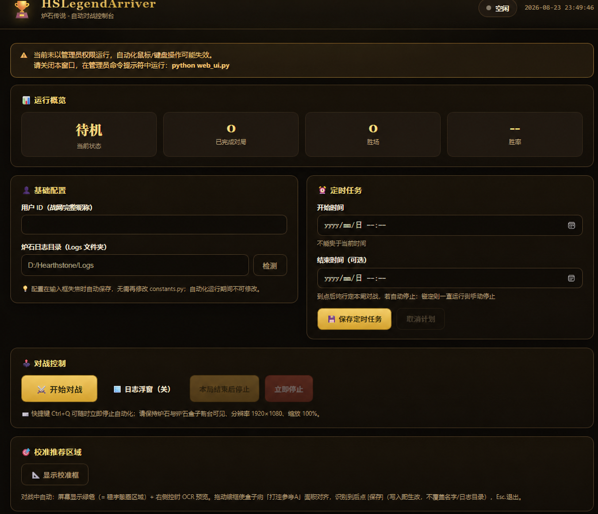

<div align="center">

# 🏆 HSLegendArriver（胜率63.8的炉石传说脚本）

### 帮你走完上传说的路

**读取炉石日志 + 获取炉石盒子打法建议 + 自动执行操作**

**33 分钟：钻石 2 → 传说**  
**一下午：冲到传说约 6000 名**  
**多盘实测胜率：机械骑 82.4%（17 局 14 胜）、号角骑 65%、弃牌术 63.8%**

<br>

> 🔥 已实测支持：**机械骑 / 号角骑 / 弃牌术 / 海盗瞎**  
> 🤖 自动识别对局、读取推荐打法并完成出牌操作

</div>

---

## ✨ 项目简介

**HSLegendArriver（传说到达者）** 是一个用于《炉石传说》的自动化打法执行器。

项目通过读取炉石对局日志，并结合 **炉石盒子「推荐打法」** 提供的推荐操作，自动识别当前对局状态并执行对应的鼠标点击与键盘操作。

> 本仓库基于原作者 **[magicstrangelzb/HearthstoneLegendArriver](https://github.com/magicstrangelzb/HearthstoneLegendArriver)** 二次开发/优化。

简单来说：

> **炉石盒子负责告诉你“怎么打”，HSLegendArriver 负责帮你“打出去”。**

目前已经使用多套卡组进行了实际天梯测试。

## 📊 实测卡组胜率

| 卡组 | 胜率 | 实测场次 |
|---|---|---|
| 机械骑 | 82.4% | 17 局 14 胜 |
| 号角骑 | 65% | 未统计 |
| 弃牌术 | 63.8% | 多盘实测 |
| 海盗瞎 | 已实测支持 | — |

## 🆕 相比原作者的优化

本版本在原作者基础上做了以下增强（**弃牌术 / 海盗瞎** 实测可用）：

### ⚡ 出牌更顺更快
- 每次完成出牌即进行下一轮OCR
- 移除「同一推荐指令被重复识别时就等待、不动作」的冗余逻辑：即使上一轮已发过同一指令（如“结束回合”），本轮识别到相同推荐仍会**立即继续执行**，不再卡住。
- **每个新回合开始只延时一次**（默认 4s，可在 `src/recommendation_config.py` 调整）给盒子更新推荐留时间；同一回合内多次出牌**不重复延时**，出牌更连贯。
- 单次操作完成后的下一轮截图延时**可配置**（`post_action_delay_seconds`），可按需微调节奏。

### 🔍 换牌阶段 OCR 更准
- OCR 预处理采用 **1.4x 缩放**（实测读「推荐打法」的精度 / 速度平衡最佳点），识别更稳。
- 换牌识别成功后留有面板稳定缓冲（`mulligan_post_ocr_delay_seconds`），并在点击前做「手牌未变、推荐未变、阶段未变、日志版本未变」的多重一致性校验，**避免识别抖动导致误点/误换**。
- 换牌后统一进入确认环节（`commit_choose_card`），换牌链路更可靠。

### 📐 截图区域可自由调节（适配不同盒子 UI 大小）
- 新增 **画框校准工具 `calibrate_roi.py`**：拖屏幕上的**绿框**整体移动、拖**右下角手柄**调整大小，把盒子「打法参考A」面板精确框进程序截图区域。小截图面积有利于提高脚本OCR速度。
- 无需改代码/坐标：校准结果写入 `ui_config.json`，程序下次启动自动读取，**适配不同分辨率与盒子窗口大小的 UI**。
- 关键调优值（OCR 置信度阈值、预处理缩放、各级延时）集中在 `src/recommendation_config.py`，便于统一调整。

## 🖥️ 实时日志浮窗（右上角）

自动对局开始时，屏幕**右上角**会出现一个**置顶半透明**小窗，实时滚动显示自动化日志，方便你在游戏里直观看到每一步：

- **自己回合开始**那一行（`[SYS] 回合 N 开始：延时` / `轮到己方操作`）用**绿色**高亮；
- `[推荐]` / `[执行]` → 白，`等待` → 灰；
- 右侧带**滚动条**，可向上翻看历史（刷新日志时不会再被拉回最底）；
- **按住鼠标左键拖动**可把窗口挪到任意位置；
- 随「开始对战」自动弹出，对局结束随 `web_ui` 退出。

> 提示：若炉石是**全屏独占**模式，Windows 桌面悬浮窗会被游戏盖住而看不到；把炉石设为**窗口化 / 无边框**即可让浮窗显示在游戏画面上。

## 🎯 校准截图区域（适配你本机盒子 UI 大小）

盒子「推荐打法」面板的位置/大小会随**盒子窗口大小、分辨率**不同而变化，程序默认的截图区域不一定刚好对准面板。首次使用或换了盒子窗口大小后，用画框工具手动校准一次：

### 1. 打开校准工具
- 网页控制台点「**校准推荐区域**」按钮；或命令行运行 `python calibrate_roi.py`。

### 2. 屏幕上出现绿框
- 屏幕上的**绿框** = 程序实际截图范围；
- 右下角有一个**缩放手柄**。

### 3. 拖动对齐
- 拖**右下角手柄** → 调整大小；
- 按住绿框**区域（不含右下角手柄）**拖动 → 整体移动；
- 把盒子面板顶部的 **「打法参考A」红头区域**框进绿框（程序靠识别这个标题判断面板是否在框内）。

### 4. 保存 / 退出
- 按 **S** 保存（写入 `ui_config.json`）；
- 按 **Esc** 退出。

### 5. 重开对局生效
- 保存后**重开一局**，程序会读取新的推荐区域再开始识别。

> 提示：本工具**无实时 OCR 预览窗**（为流畅做了精简），对齐后由自动化实际识别验证；程序固定 **1920×1080、缩放 100%**，如需更大/更小的盒子窗口，重新画框即可。

## 🃏 实测卡组（可直接复制）

### 号角骑（针对脏牧特攻）

```text
# 职业：圣骑士
# 模式：狂野模式
#
# 1x (1) 古神在上
# 2x (1) 奇迹推销员
# 2x (1) 正义保护者
# 2x (1) 深铁穴居人
# 2x (2) 决战！
# 1x (2) 威猛银翼巨龙
# 2x (2) 尼鲁巴蛛网领主
# 1x (2) 淘金客
# 2x (2) 螃蟹骑士
# 2x (3) 布吉舞乐
# 1x (3) 绒绒虎
# 2x (3) 锋鳞
# 2x (4) 十字军光环
# 2x (4) 战斗号角
# 2x (4) 飞龙机动
# 1x (5) 诺兹多姆，青铜守护巨龙
# 2x (7) 棱彩光束
# 1x (7) 永恒者诺兹多姆
# 
AAEBAaToAgaD3gO2igS8jwbOnAbRqQblwQcMiA740gKR5APJoAThpATBxAXI+AWFjgaZjgb1lQaDwgea/AcAAA==
# 
# 想要使用这副套牌，请先复制到剪贴板，然后在游戏中点击“新套牌”进行粘贴。
```

### 机械骑

```text
# 职业：圣骑士
# 模式：狂野模式
#
# 1x (1) 圣礼骑士
# 1x (1) 无人机拆解器
# 2x (1) 频率振荡机
# 2x (2) P1CK-P0K3T扒窃机
# 2x (2) 安保自动机
# 1x (2) 忙碌机器人
# 2x (2) 紫色珍鳃鱼人
# 2x (2) 超级电容器
# 2x (2) 雷达探测
# 1x (3) 大铡蟹
# 1x (3) 石炉守备官
# 2x (3) 空中飞爪
# 2x (3) 青铜门卫
# 2x (4) 十字军光环
# 1x (4) 恶火
# 2x (4) 泡泡机器人
# 2x (4) 金翼巨龙
# 1x (5) 指挥官碧阿崔克丝
#   1x (2) 通电机器人
# 1x (0) 奇利亚斯豪华版3000型
#   1x (0) 奇利亚斯豪华版3000型
#   1x (3) 输能模块
#   1x (4) 计数模块
# 
AAEBAaToAgiftwPM6wP5pAS5/gXHpAaf4Qa/+Qad3QcLpfUCh64DkrUE1L0E2tMEhKUF2dAF4vEGupYH2uIHmvwHAAEE1/4Cnd0H87MGx6QG9rMGx6QG6N4Gx6QGAAA=
# 
# 想要使用这副套牌，请先复制到剪贴板，然后在游戏中点击“新套牌”进行粘贴。
```

## 🐍 详细安装（含 pip 与清华镜像）

> 需要 **Python 3.12**（自带 pip）。以下从零说明如何安装 Python、装 pip，并快速装好本项目依赖。

### 1. 安装 Python 3.12
- 到 <https://www.python.org/downloads/> 下载 **Python 3.12** 安装包；
- 安装时**务必勾选 “Add python.exe to PATH”**；
- 装完在 PowerShell 运行 `python --version`，看到版本号即成功（新版 Python 自带 pip）。

### 2. 如果没有 pip
一般新版 Python 自带 pip；若提示没有 pip，先下载安装：
- 下载 `get-pip.py`：浏览器打开 <https://bootstrap.pypa.io/get-pip.py> 另存，或在 PowerShell 运行：
  ```text
  curl https://bootstrap.pypa.io/get-pip.py -o get-pip.py
  ```
- 在 `get-pip.py` 所在目录运行：
  ```text
  python get-pip.py
  ```
- 验证：`python -m pip --version`

### 3. 用清华 TUNA 镜像安装依赖
- 在项目根目录（含 `requirements.txt` 的位置）打开 PowerShell，运行：
  ```text
  pip install -r requirements.txt -i https://pypi.tuna.tsinghua.edu.cn/simple
  ```
- 依赖较大（含 PaddleOCR / PaddlePaddle），耐心等待下载安装完成。

### 4. 启动
- **以管理员身份**运行：
  ```text
  python web_ui.py
  ```
- 浏览器会自动打开 `http://127.0.0.1:8765`（若被占用会自动换端口，以控制台打印为准）。


---


## 🚀 快速开始

只需要 **3 步**。

### 1️⃣ 打开炉石与炉石盒子

启动：

- 《炉石传说》
- 《炉石传说盒子》


在卡组列表中选择需要运行的卡组，例如：

**弃牌术**


---

### 2️⃣ 修改配置

> 💡 嫌麻烦？可以跳过本节，直接使用 **Web 控制台**在页面上填写配置（见下文「🖥️ Web 控制台」）。

打开：

```text
constants/constants.py
```

找到以下配置：

```python
HEARTHSTONE_LOG_ROOT = "D:/Hearthstone/Logs"

YOUR_NAME = "YOURID"
```

修改为自己的信息。

#### `HEARTHSTONE_LOG_ROOT`

炉石日志目录。

例如：

```python
HEARTHSTONE_LOG_ROOT = "D:/Hearthstone/Logs"
```

通常可以在炉石传说安装目录中找到：

```text
Logs
```

文件夹。

#### `YOUR_NAME`

填写你的完整炉石 BattleTag：

```python
YOUR_NAME = "用户名#编号"
```

例如：

```python
YOUR_NAME = "为所欲为、异灵术#54321"
```

---

### 3️⃣ 管理员权限启动 ⚠️

> **这一步非常重要。**

因为程序需要模拟鼠标点击和键盘操作，所以必须使用 **管理员权限** 运行。

#### Windows

右键：

```text
命令提示符
```

选择：

> **以管理员身份运行**

进入项目目录：

```bash
cd /d D:\HSLegendArriver
```

安装依赖：

```bash
pip install -r requirements.txt
```


启动：

```bash
python main.py
```

然后就可以开始了。🚀

---

## 🖥️ Web 控制台（推荐，可选定时执行对战程序）

不想改代码？用自带的可视化控制台：**图形化配置 + 定时执行 + 一键开始对战**，无需手动修改 `constants.py`。

### 启动方式

在 **管理员命令提示符** 中进入项目目录，运行：

```bash
pip install -r requirements.txt   # 首次运行需要安装依赖
python web_ui.py
```

浏览器会自动打开：

```text
http://127.0.0.1:8765
```

无需虚拟环境，直接用系统 Python 安装依赖即可；如果自己创建了虚拟环境，名字随意（如 `venv`、`myenv`），先激活再运行 `python web_ui.py` 即可。
### 游戏界面

### 页面功能

| 功能 | 说明 |
| --- | --- |
| 👤 基础配置 | 填写用户 ID（完整战网昵称）与炉石日志目录，失焦自动保存并立即生效 |
| ⚔️ 开始对战 | 一键立即启动自动化对战 |
| ⏰ 定时任务 | 设置开始 / 结束时间；**开始时间不能早于当前时间**，到达结束时间后**先打完本局对战再自动停止** |
| 🛑 停止控制 | 「本局结束后停止」与「立即停止」两种方式；Ctrl+Q 亦可立即停止 |
| 📊 运行概览 | 实时显示对局数、胜场、胜率与当前状态 |
| 📜 实时日志 | 页面内实时查看自动化运行日志 |

> ⚠️ 定时任务期间请保持控制台程序运行（浏览器可以关闭，重开页面即可看到状态）。

---

## 🛠️ 环境要求

当前版本需要：

| 项目 | 要求 |
| --- | --- |
| 操作系统 | Windows |
| Python | 3.10 – 3.12（推荐 3.12；不支持 3.13+） |
| 炉石传说 | 已安装 |
| 炉石盒子 | 已安装 |
| 炉石盒子语言 | 简体中文 |
| 桌面分辨率 | **1920 × 1080** |
| 炉石分辨率 | **1920 × 1080** |
| Windows 缩放 | **100%** |

安装 Python 依赖：

```bash
pip install -r requirements.txt
```

---

## ⚠️ 启动前检查

如果程序出现点击位置错误，请优先确认以下设置。
- [ ] 盒子推荐打法位于屏幕左侧
- [ ] Windows 桌面分辨率为 **1920 × 1080**
- [ ] 炉石传说分辨率为 **1920 × 1080**
- [ ] Windows 显示缩放为 **100%**
- [ ] 炉石使用全屏窗口 / 全屏显示
- [ ] 炉石盒子左侧「推荐打法」完整显示
- [ ] 炉石盒子使用 **简体中文**
- [ ] 炉石 / 炉石盒子窗口未被其他窗口遮挡
- [ ] 使用 **管理员权限** 启动 Python
- [ ] `HEARTHSTONE_LOG_ROOT` 配置正确
- [ ] `YOUR_NAME` 配置正确

---


## 🃏 已测试卡组

### ✅ 弃牌术

目前测试最充分的卡组之一。

卡组代码：

```text
AAEBAa35AwaPggPV0QP5xgXxoQb2oQbGsgcMzge1uQPQ4QOYkgWrkgWVygbXlweEmQekrQfWvgfZvgfPvwcAAA==
```

### ✅ 海盗瞎

已完成实际对局测试，个人认为可以正常执行打法。

---


## 🤝 Contributing

如果你在使用过程中遇到问题，或者有功能建议，**欢迎直接提交 Issue**。

建议在 Issue 中尽量提供：

- 🐛 **Bug 反馈以及游戏界面运行截图**：说明问题现象、复现步骤和运行环境附上运行截图
- 💡 **功能建议**：描述希望支持的功能或使用场景
- 🃏 **卡组适配**：注明卡组名称、相关交互以及异常情况
- 🖼️ **界面问题**：如涉及点击坐标或 UI 变化，建议附截图


---

## ⭐

如果这个项目：

- 让你觉得有意思
- 给了你一些自动化 / 炉石 AI 的灵感

欢迎点一个 **Star ⭐**，这对我真的很重要！！！

你的 Star 会让我知道还有人在使用这个项目，也会成为继续适配新版本和新卡组的动力。

> **如果真的靠它上传说了，回来留个 Star 吧 😎**

---

## 🙏 致谢

本项目参考了以下开源项目：

- [Yiyuan-Dong/AutoHS](https://github.com/Yiyuan-Dong/AutoHS)
- [FallAbyss/AutoHS](https://github.com/FallAbyss/AutoHS)

感谢原作者们提供的思路和开源代码。

---

## ⚠️ Disclaimer

本项目仅用于 **技术研究与代码交流**。


---

<div align="center">

### 🏆 HSLegendArriver

**让 AI 帮你走完最后一段上传说的路。**

如果你觉得这个项目有意思：

## ⭐ Star 一下吧 ⭐

</div>
